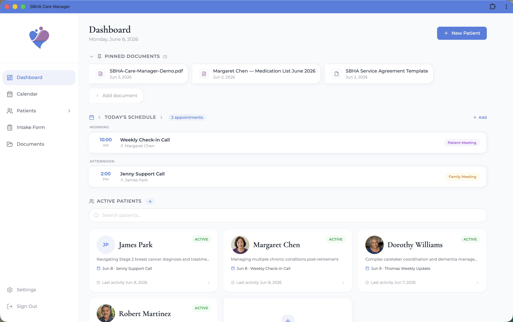

# SBHA Care Manager

A full-stack patient management platform built for **South Bay Health Advocates**, an independent healthcare advocacy practice in the South Bay area of Los Angeles.

## Live Demo

**[sbha-care-manager.vercel.app](https://sbha-care-manager.vercel.app)**

Demo login:
- Email: `demo@demo.com`
- Password: `Demo1234!`

## What It Does

SBHA Care Manager replaces scattered Word documents, spreadsheets, and sticky notes with one organized, secure tool for managing patient relationships. Built for a PharmD with 25 years of clinical experience who helps patients navigate the healthcare system.

**Patient Management**
- Full patient profiles — demographics, conditions, medications, allergies, providers, caretakers, and insurance
- Intake form that mirrors the existing Google Form onboarding workflow
- Archive and restore patients as their advocacy engagement changes

**Notes & Documentation**
- Rich text notes with bold, italic, bullets, and text colors
- Note categories — Call Summary, Appointment Note, Action Item, Family Communication
- File attachments and voice recordings on notes
- Search and filter notes by type, date, and content

**Scheduling**
- Mini appointment calendar on each patient profile
- Full calendar page with month and week views, color-coded by appointment type
- Recurring appointments
- Sync events to Apple Calendar, Google Calendar, or any external calendar via .ics export

**Billing & Admin**
- Session timer for tracking billable hours during patient meetings
- Session history with total hours logged per patient
- Medication list PDF export formatted for sharing with patients
- Document management with pinning and patient assignment

**Built for Real Use**
- Mobile-responsive — works on iPhone, iPad, and Mac
- Installable as a native app via PWA (no app store required)
- Secure login with forgot password flow and session timeout after inactivity
- User data isolation — each account only sees its own patients

## Tech Stack

| Layer | Technology |
|-------|-----------|
| Frontend | React 18 + Vite |
| Styling | Tailwind CSS |
| Database | Supabase (PostgreSQL) |
| Auth | Supabase Auth |
| Storage | Supabase Storage |
| Rich Text | TipTap |
| Hosting | Vercel |

## About This Project

I built this as a complete beginner to software development using Claude Code as my primary tool — it's the first real product I've shipped.

I'm a Marketing & Business Analytics student at Indiana University's Kelley School of Business. My background is in GTM strategy, growth marketing, and consumer insights — not engineering. This project came from a real need: my mom runs a healthcare advocacy practice and was managing everything in scattered docs and spreadsheets.

I scoped the product, designed the UX, made every technical decision, and shipped it to production. The app is live and my mom is actively using it.

**Aashna Patel**
[linkedin.com/in/aashnatpatel](https://linkedin.com/in/aashnatpatel) · aashnapatel@gmail.com
